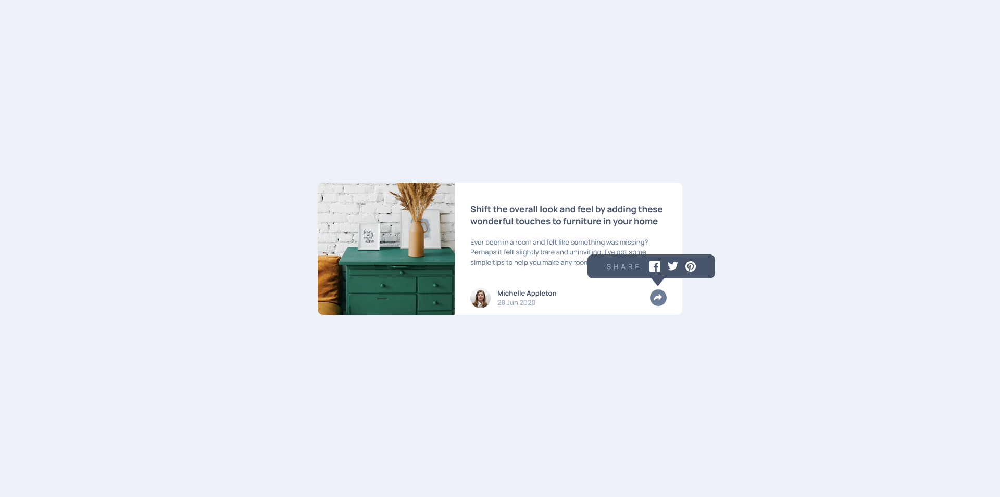

# Frontend Mentor - Article preview component solution

This is a solution to the [Article preview component challenge on Frontend Mentor](https://www.frontendmentor.io/challenges/article-preview-component-dYBN_pYFT). Frontend Mentor challenges help you improve your coding skills by building realistic projects. 

## Table of contents

- [Overview](#overview)
  - [The challenge](#the-challenge)
  - [Screenshot](#screenshot)
  - [Links](#links)
- [My process](#my-process)
  - [Built with](#built-with)
  - [What I learned](#what-i-learned)
  - [Continued development](#continued-development)
- [Author](#author)
- [Acknowledgments](#acknowledgments)


## Overview

### The challenge

Users should be able to:

- View the optimal layout for the component depending on their device's screen size
- See the social media share links when they click the share icon

### Screenshot



### Links

- Solution URL: [here](https://your-solution-url.com)
- Live Site URL: [here](https://your-live-site-url.com)

## My process

### Built with

- Semantic HTML5 markup
- CSS custom properties
- Flexbox
- Mobile-first workflow

### What I learned

This one only looked simple, but when it came to making the baloon showin in a diferent way for the diferent media queries, it became more complex. Also, the desktop version wasn't working just because the class visible wasnt declared in the right place. This challenge came with a lot of learnings.

```css
.baloon {
        border-radius: 10px;
        padding: 1rem 0;
        width: 35%;
        left: 74%;
        bottom: 70px;
        display: none;
        justify-content: center;
    }
```

The button function adapted to make the svg change its color when selected.

```js
function changeContent() {
    if (baloon.classList.contains('visible')) {
        btn.classList.remove('selected-state')
        arrow.removeAttribute('fill')
        arrow.setAttribute('fill', '#6E8098')
        baloon.classList.remove('visible')
    } else {
        btn.classList.add('selected-state')
        arrow.removeAttribute('fill')
        arrow.setAttribute('fill', '#fff')
        baloon.classList.add('visible')
    }
}

### Continued development

Looking foward to make some adjustments on the css code, and making some animations and transitions.


## Author

- Frontend Mentor - [@jAllanOli](https://www.frontendmentor.io/profile/jAllanOli)
- gitHub - [@jAllanOli](https://github.com/jAllanOli)

## Acknowledgments

My savior on this project was my friend's boyfriend, Osvaldo. Who found the issue on the visible class declaration.
